# 📘 โตทัน — ภาพรวมโปรเจกต์ (Project Overview)

> อธิบายแบบ **เริ่มจากศูนย์** ไม่ต้องมีความรู้มาก่อน
> อ่านจากบนลงล่างได้เลย แต่ละหัวข้อต่อยอดจากหัวข้อก่อนหน้า

> 💡 **ดูรูปภาพ (diagram) ยังไง?**
> ไฟล์นี้มีแผนผังเขียนด้วย **Mermaid** — เปิดไฟล์นี้บน **GitHub** หรือใน **VS Code** (ติดตั้งส่วนเสริม *Markdown Preview Mermaid Support*) แล้วโค้ดแผนผังจะกลายเป็น **รูปภาพ** อัตโนมัติ ไม่ต้องวาดเอง

## 🧭 สารบัญ

| ส่วน | หัวข้อ | อ่านแล้วได้อะไร |
|------|--------|-----------------|
| เข้าใจระบบ | [1. โปรเจกต์นี้คืออะไร](#-1-โปรเจกต์นี้คืออะไร-ฉบับเด็กแรกเกิด) · [2. ใครใช้บ้าง](#-2-ใครใช้ระบบนี้บ้าง) · [3. ภาพใหญ่](#️-3-ระบบประกอบด้วยอะไรบ้าง-ภาพใหญ่) · [4. แต่ละ Service](#-4-แต่ละ-service-ทำอะไร-ทีละตัว) | รู้ว่าระบบทำอะไร มีชิ้นส่วนอะไรบ้าง |
| เข้าใจการทำงาน | [5. Workflow หลัก](#-5-workflow-หลัก-ระบบทำงานยังไงทีละสเต็ป) · [6. Gateway](#️-6-ทำไมต้องมี-gateway-เรื่องความปลอดภัย) · [7. Redis/Event](#-7-redis-กับการ-ส่งข่าว-event) · [8. ข้อมูล](#️-8-ข้อมูลถูกเก็บยังไง-ความสัมพันธ์ของข้อมูล) · [9. AI](#-9-ai-ทำงานยังไง-5-ขั้นตอน) | เห็นเส้นทางข้อมูลตั้งแต่กดปุ่มจนถึงอีเมล |
| ลงมือ + อนาคต | [10. เทคโนโลยี](#-10-เทคโนโลยีที่ใช้-สรุป) · [11. พอร์ต + วิธีรัน](#-11-พอร์ตทั้งหมด--วิธีรัน) · [12. สรุปภาพเดียว](#️-12-สรุปทั้งหมดในภาพเดียว) · [**13. เส้นทางสู่ Production**](#-13-เส้นทางสู่-production-จากเครื่องเรา--ให้โลกใช้) 🆕 | รันเองได้ + รู้ว่าต้องทำอะไรต่อเพื่อปล่อยของจริง |

---

## 🍼 1. โปรเจกต์นี้คืออะไร (ฉบับเด็กแรกเกิด)

ลองนึกภาพ **โรงพยาบาลเด็กเล็ก ๆ ในมือถือ**

- เด็กบางคนสูงช้า/เร็วกว่าเพื่อน พ่อแม่กังวลว่า "ลูกจะสูงเท่าไหร่ตอนโต?"
- หมอใช้วิธี **เอกซเรย์ (X-ray) มือซ้าย** แล้วดู "อายุของกระดูก" เทียบกับอายุจริง
- แต่การอ่าน X-ray ด้วยตาเปล่าใช้เวลานานและต้องใช้ความเชี่ยวชาญสูง

**โตทัน** เข้ามาช่วยตรงนี้ 👇

```
หมอถ่าย X-ray มือ  ──►  AI ดูให้ใน 30 วินาที  ──►  บอกอายุกระดูก + ทำนายส่วนสูงตอนโต
        │                                                      │
        └──────────────►  หมอเขียนคำแนะนำ + นัดวันตรวจ  ◄───────┘
                                      │
                          พ่อแม่ได้อีเมล + เปิดดูในแอปได้
```

พูดสั้น ๆ: **"ถ่ายรูป → AI อ่าน → หมอยืนยัน → พ่อแม่รับผล"**

---

## 👥 2. ใครใช้ระบบนี้บ้าง

| ตัวละคร | คือใคร | ทำอะไรในระบบ |
|---------|--------|--------------|
| 👩‍⚕️ **หมอ (Doctor)** | กุมารแพทย์ | เปิดเคสเด็ก, อัปโหลด X-ray, ตรวจผล AI, เขียนคำแนะนำ, นัดติดตาม |
| 👨‍👩‍👧 **ผู้ปกครอง (Parent)** | พ่อแม่เด็ก | ดูผลการเจริญเติบโตของลูก, อ่านคำแนะนำจากหมอ, ดูวันนัด |
| 🧠 **AI** | โปรแกรมคอมพิวเตอร์ | "อ่าน" ภาพ X-ray แทนสายตาคน แล้วคำนวณอายุกระดูก |

> หมอกับผู้ปกครองเห็น **หน้าจอคนละแบบ** แม้จะเป็นแอปเดียวกัน (ระบบเช็ก "บทบาท" ว่าใครเป็นใคร)

---

## 🏗️ 3. ระบบประกอบด้วยอะไรบ้าง (ภาพใหญ่)

โปรเจกต์นี้ **ไม่ได้เป็นโปรแกรมก้อนเดียว** แต่แยกเป็นหลาย "ผู้ช่วย" (เรียกว่า **Service**) แต่ละตัวทำงานอย่างเดียวให้เก่ง แล้วคุยกัน

ลองนึกว่าเป็น **พนักงานในโรงพยาบาล** แต่ละแผนกทำหน้าที่ของตัวเอง:

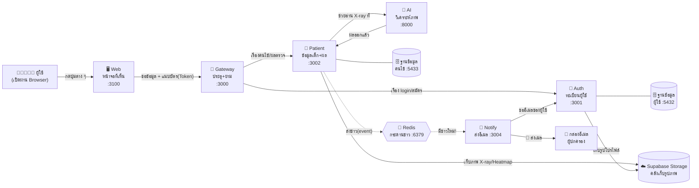

**อ่านแผนผังยังไง:**
- เส้นทึบ `──►` = "ขอข้อมูลแล้วรอคำตอบทันที" (เหมือนโทรถาม)
- เส้นประ `--.->` = "ฝากข่าวไว้ ใครว่างค่อยมาทำ" (เหมือนติดประกาศ)

---

## 🧩 4. แต่ละ Service ทำอะไร (ทีละตัว)

### 🖥️ Web — หน้าจอที่ผู้ใช้เห็น
- **เปรียบเหมือน:** หน้าร้าน / เคาน์เตอร์ที่ลูกค้าเดินเข้ามา
- **ทำอะไร:** แสดงปุ่ม ฟอร์ม กราฟ ภาพ X-ray ทุกอย่างที่ตาเห็น
- **เทคโนโลยี:** Next.js 14 (React) — รันที่พอร์ต **3100**
- **สำคัญ:** Web **ไม่เก็บข้อมูลเอง** มันแค่ "หน้าตา" เวลาต้องการข้อมูลจริงจะไปถาม Gateway

### 🚪 Gateway — ประตูกลาง + ยามรักษาความปลอดภัย
- **เปรียบเหมือน:** ป้อมยามหน้าโรงพยาบาล ทุกคนต้องผ่านตรงนี้ก่อน
- **ทำอะไร 3 อย่าง:**
  1. **ตรวจบัตร (JWT Token):** ใครไม่มีบัตร/บัตรปลอม → ไม่ให้ผ่าน
  2. **บอกต่อว่าใครเป็นใคร:** แปะป้าย `x-user-id`, `x-user-role` ให้ service ข้างในรู้ว่าเป็นหมอหรือผู้ปกครอง
  3. **กันยิงรัว (Rate limit):** เฉพาะเส้นทางอ่อนไหว (login / สมัคร / ขอ OTP) ถ้าใครกดถี่เกินไป → เบรกไว้ก่อน (ตอนนี้จำใน memory ของ gateway เอง — ถ้าอนาคตรัน gateway หลายตัวต้องย้ายไปนับใน Redis)
- **รันที่พอร์ต 3000** — เป็นประตูเดียวที่โลกภายนอกเข้าถึงได้

### 🔐 Auth — แผนกทะเบียน (สมัคร / เข้าสู่ระบบ)
- **เปรียบเหมือน:** ฝ่ายทำบัตรประชาชน
- **ทำอะไร:** สมัครสมาชิก, ยืนยันอีเมลด้วยรหัส OTP, login แล้วออก "บัตร (Token)", เก็บโปรไฟล์หมอ/ผู้ปกครอง, เปลี่ยนรหัสผ่าน, อัปโหลดรูปโปรไฟล์
- **เก็บข้อมูลที่:** ฐานข้อมูลผู้ใช้ (Postgres :5432)

### 👶 Patient — แผนกเวชระเบียน (หัวใจของระบบ)
- **เปรียบเหมือน:** ห้องเก็บแฟ้มประวัติคนไข้
- **ทำอะไร:** เก็บข้อมูลเด็ก, การประเมินแต่ละครั้ง, ผลจาก AI, คำแนะนำ, วันนัดติดตาม
- **คุยกับ AI:** เวลาหมออัปโหลด X-ray → Patient จะส่งให้ AI วิเคราะห์ แล้วรับผลกลับมาเก็บ
- **เก็บข้อมูลที่:** ตัวหนังสือ/ตัวเลข → ฐานข้อมูลคนไข้ (Postgres :5433) ส่วน **ไฟล์ภาพ** (X-ray, heatmap) → อัปโหลดขึ้น **Supabase Storage** (คลังไฟล์บนคลาวด์) แล้วเก็บแค่ "ลิงก์" ไว้ในฐานข้อมูล

### 🧠 AI — แผนกอ่านฟิล์ม X-ray
- **เปรียบเหมือน:** รังสีแพทย์ผู้เชี่ยวชาญที่อ่านฟิล์มเก่งมากและเร็วมาก
- **ทำอะไร:** รับภาพ X-ray → ผ่านโมเดล AI 5 ขั้น → คืน **อายุกระดูก + ความมั่นใจ + ภาพ heatmap + ทำนายส่วนสูง**
- **เทคโนโลยี:** Python + FastAPI — รันที่พอร์ต **8000** (รายละเอียดขั้นตอนดู[หัวข้อ 9](#-9-ai-ทำงานยังไง-5-ขั้นตอน))
- ⚠️ **สถานะตอนนี้: ยังเป็น "ตัวจำลอง" (Mock)** — โครงท่อ 5 ขั้นวางไว้ครบแล้ว แต่ยังไม่ได้ใส่โมเดลจริง ผลที่ตอบกลับจะติดธง `isMock=true` และหน้าเว็บจะแสดงป้ายเตือนให้เห็นชัด (ดูรายละเอียดใน[หัวข้อ 9.1](#️-91-สถานะปัจจุบัน-ai-ยังเป็น-mock))

### ☁️ Supabase Storage — คลังเก็บรูปภาพบนคลาวด์
- **เปรียบเหมือน:** ห้องเก็บฟิล์ม X-ray แยกจากตู้แฟ้มเอกสาร
- **ทำอะไร:** เก็บ **ไฟล์ภาพ** ทั้งหมดของระบบ — ภาพ X-ray, ภาพ heatmap จาก AI, รูปโปรไฟล์ผู้ใช้
- **ทำไมไม่เก็บในฐานข้อมูล?** ฐานข้อมูลเก่งเรื่องตัวหนังสือ/ตัวเลข แต่ไฟล์ภาพก้อนใหญ่จะทำให้อืด — เลยฝากไฟล์ไว้บนคลาวด์ แล้วเก็บแค่ลิงก์
- ⚠️ **จุดที่ต้องแก้ก่อนใช้จริง:** ตอนนี้ bucket เป็นแบบ **public** (ใครมีลิงก์ก็เปิดดูได้) — ภาพ X-ray ของเด็กเป็นข้อมูลสุขภาพ ต้องเปลี่ยนเป็น **private + signed URL** (ลิงก์ชั่วคราวที่หมดอายุได้) ก่อนปล่อย production

### 🔔 Notify — แผนกส่งจดหมาย
- **เปรียบเหมือน:** บุรุษไปรษณีย์
- **ทำอะไร:** คอยฟัง "ข่าว" จากกระดานข่าว (Redis) ถ้ามีข่าว เช่น "หมอส่งผลแล้ว" → ส่งอีเมลหาผู้ปกครอง
- **รันที่พอร์ต 3004**

### 📨 Redis — กระดานข่าวกลาง
- **เปรียบเหมือน:** บอร์ดติดประกาศกลางโรงพยาบาล
- **ทำอะไร:** ให้ service ติดประกาศ ("ปล่อย event") ทิ้งไว้ แล้ว service อื่นที่สนใจมาอ่านเอง — ทำให้ Patient ไม่ต้องรอ Notify ส่งเมลเสร็จ (ทำงานต่อได้เลย)

### 🗄️ PostgreSQL — ตู้เก็บเอกสาร
- **เปรียบเหมือน:** ตู้แฟ้มล็อกกุญแจ
- มี **2 ตู้แยกกัน:** ตู้ผู้ใช้ (Auth) กับ ตู้คนไข้ (Patient) — แยกเพื่อความปลอดภัยและจัดการง่าย

---

## 🔄 5. Workflow หลัก (ระบบทำงานยังไงทีละสเต็ป)

### 5.1 สมัคร + ยืนยันอีเมล + เข้าสู่ระบบ

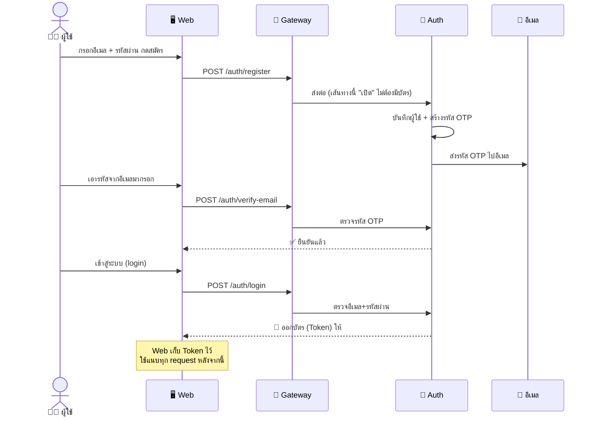

> 🎫 **Token คืออะไร?** = บัตรผ่านชั่วคราวที่บอกว่า "ฉันคือใคร และเป็นหมอหรือผู้ปกครอง" ทุกครั้งที่ขอข้อมูล Web จะแนบบัตรนี้ไป Gateway จะตรวจก่อนเสมอ

---

### 5.2 หมออัปโหลด X-ray → AI วิเคราะห์ → ได้ผล ⭐ (ขั้นตอนหัวใจ)

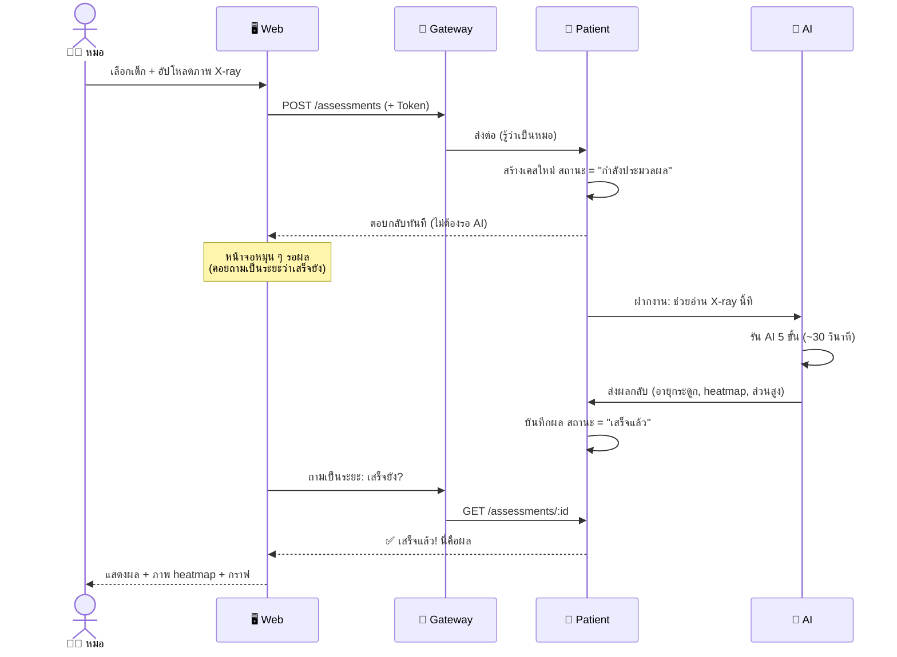

> 💡 **ทำไม Patient ตอบกลับก่อนที่ AI จะเสร็จ?**
> เพราะโมเดลจริงใช้เวลาราว ~30 วินาที ถ้าให้หมอนั่งค้างหน้าจอรอจะแย่ ระบบจึง "รับงานไว้ก่อน" แล้วให้หน้าจอคอยถามเป็นระยะว่าเสร็จหรือยัง (เรียกว่า *polling*)
> *(อายุกระดูกมาจากโมเดลจริงของทีมบน HuggingFace Space — ดู[หัวข้อ 9.1](#-91-สถานะปัจจุบัน-โมเดลจริงบน-hf-space) ถ้าโมเดลล่มระบบจะตอบสถานะ "ผิดพลาด" ให้หมอกด "วิเคราะห์ใหม่" ได้ — **ไม่มีการปลอมผลแทน**)*

---

### 5.2.5 หมอรีวิวผลก่อนเสมอ — ผู้ปกครองยังไม่เห็น 🔒🆕

> **หลักการ:** ผล AI ทุกใบต้อง "ผ่านตาแพทย์" ก่อน — ผู้ปกครองจะ**มองไม่เห็นผลนี้เลย**ทั้งในแอปและอีเมล จนกว่าหมอจะกด "ส่งผลให้ผู้ปกครอง"

เมื่อ AI วิเคราะห์เสร็จ หมอเปิดดูรายละเอียดแล้วเลือกได้ 2 ทาง:

| ทางเลือก | ทำยังไง | ป้ายที่ติดบนผล |
|----------|---------|----------------|
| ✅ **เห็นด้วยกับ AI** | กดปุ่ม "ยืนยันผลตามนี้" (ไม่ต้องแก้อะไร) | 🟢 "แพทย์ตรวจสอบแล้ว" |
| ✏️ **ไม่เห็นด้วย** | กด "ปรับผล" แก้อายุกระดูก / ส่วนสูงพยากรณ์ (FAH) / การแปลผล | 🟢 "แพทย์ตรวจสอบแล้ว" + 🔵 "แพทย์ปรับผลแล้ว" |

**ระบบเก็บ "ค่าดิบจาก AI" แยกไว้เสมอ** (คอลัมน์ `aiBoneAgeMonths` ฯลฯ) — หมอปรับกี่ครั้งก็ยังเทียบย้อนได้ว่า AI ให้เท่าไหร่ → หมอปรับเป็นเท่าไหร่ (โชว์เฉพาะฝั่งหมอ) และถ้าสั่ง AI วิเคราะห์ใหม่ สถานะรีวิวจะถูกล้างให้รีวิวใหม่ทุกครั้ง

---

### 5.3 หมอส่งผล + คำแนะนำ + วันนัด → ผู้ปกครองรับ 🆕

> นี่คือฟีเจอร์ที่ทำให้ "หมอ" กับ "ผู้ปกครอง" เชื่อมถึงกัน

```mermaid
sequenceDiagram
  actor D as 👩‍⚕️ หมอ
  participant W as 🖥️ Web
  participant P as 👶 Patient
  participant R as 📨 Redis
  participant N as 🔔 Notify
  participant A as 🔐 Auth
  actor Par as 👨‍👩‍👧 ผู้ปกครอง

  D->>W: กรอกวันนัด + คำแนะนำ กด "ส่งให้ผู้ปกครอง"
  W->>P: POST /assessments/:id/notify-parent
  P->>P: 1) บันทึกวันนัด + เวลาส่ง
  P->>P: 2) บันทึก "คำแนะนำ" ให้ผู้ปกครองดูในแอป
  P-->>R: 3) ติดประกาศ event "parent.notify"
  P-->>W: ✅ ส่งแล้ว

  R-->>N: มีประกาศใหม่!
  N->>A: ขออีเมลของผู้ปกครองคนนี้
  A-->>N: นี่อีเมล
  N->>Par: 📧 ส่งอีเมลสรุปผล + วันนัด + คำแนะนำ

  Par->>W: เปิดแอป เข้าเมนู "คำแนะนำจากแพทย์"
  W-->>Par: เห็นคำแนะนำ + 📅 วันนัด (กดอ่านได้)
```

**จุดสำคัญของฟีเจอร์นี้:** หมอกดส่ง **ครั้งเดียว** แต่ผู้ปกครองได้รับ **3 อย่างพร้อมกัน**
1. 📧 **อีเมล** (สรุปผลเต็ม + วันนัด + คำแนะนำ)
2. 📱 **ในแอป** เมนูคำแนะนำ (อ่านได้ทุกที่ พร้อมป้ายวันนัด)
3. 🔓 **ผลตรวจ "ปลดล็อก" ให้เห็นในแอป** — ก่อนหน้านี้ผู้ปกครองมองไม่เห็นเคสนี้เลย (ดู [5.2.5](#525-หมอรีวิวผลก่อนเสมอ--ผู้ปกครองยังไม่เห็น-))

> ถ้าหมอ "ส่งใหม่/แก้ไข" ระบบจะ **อัปเดตคำแนะนำเดิม** (ไม่สร้างซ้ำ) แล้วเด้งเป็น "ยังไม่อ่าน" อีกครั้ง

---

### 5.4 ระบบเตือนวันนัดอัตโนมัติ ⏰

ไม่ต้องมีคนกดเอง — Patient มี "นาฬิกาปลุก" ในตัว คอยเช็กทุก 12 ชั่วโมง (เตือนเฉพาะเคสที่หมอ**ส่งผลให้ผู้ปกครองแล้ว**เท่านั้น — นัดที่หมอจดไว้เองโดยยังไม่ปล่อยผล ผู้ปกครองจะไม่ได้เมลถึงนัดที่ตัวเองไม่รู้จัก)

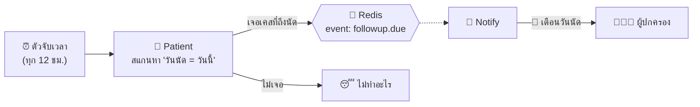

---

## 🛡️ 6. ทำไมต้องมี Gateway (เรื่องความปลอดภัย)

ทุก request จากภายนอก **ต้องผ่าน Gateway เท่านั้น** — service ข้างในไม่เปิดให้โลกภายนอกแตะตรง ๆ

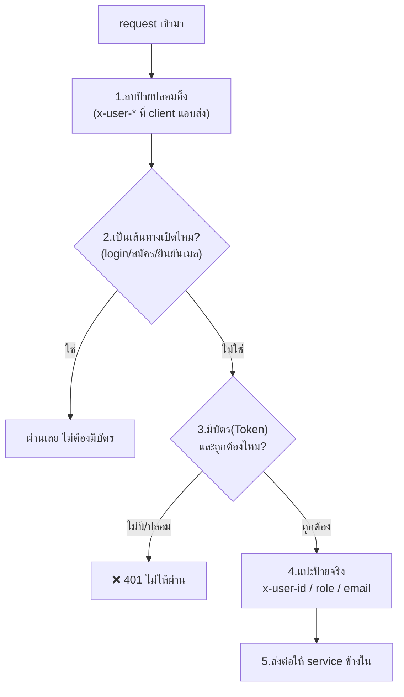

> 🔑 **ของแสบที่ป้องกัน:** ถ้าคนร้ายแอบส่งป้าย "ฉันเป็นหมอ" มาเอง Gateway จะ **ลบทิ้งก่อนเสมอ (ขั้นที่ 1)** แล้วแปะป้ายจริงจากการตรวจบัตรเท่านั้น (ขั้นที่ 4) — ปลอมไม่ได้

---

## 📨 7. Redis กับการ "ส่งข่าว" (Event)

ปัญหา: ถ้า Patient ต้องรอ Notify ส่งอีเมลเสร็จก่อนค่อยตอบหมอ → ช้าและพังง่าย (ถ้าเมลล่ม หมอก็ทำงานไม่ได้)

วิธีแก้: ใช้ Redis เป็น **กระดานข่าว** — Patient แค่ "ติดประกาศ" แล้วไปทำงานต่อ ใครสนใจค่อยมาอ่าน

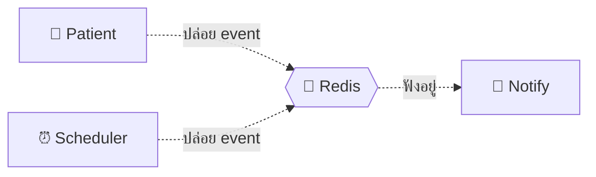

**รายการข่าว (event) ในระบบ:**

| ชื่อ event | ใครปล่อย | หมายความว่า | Notify ทำอะไร |
|-----------|---------|-------------|---------------|
| `parent.notify` | Patient | หมอกดส่งผล+วันนัด | ส่งอีเมลสรุปผลให้ผู้ปกครอง |
| `recommendation.sent` | Patient | มีคำแนะนำใหม่ | ส่งอีเมลแจ้งเตือน |
| `followup.due` | Scheduler | ถึงวันนัดแล้ว | ส่งอีเมลเตือนวันนัด |

> 💡 ข้อดี: ถ้า Notify ล่มชั่วคราว งานหลัก (บันทึกผล) **ไม่พัง** — ข่าวยังอยู่ ส่งเมลทีหลังได้

---

## 🗃️ 8. ข้อมูลถูกเก็บยังไง (ความสัมพันธ์ของข้อมูล)

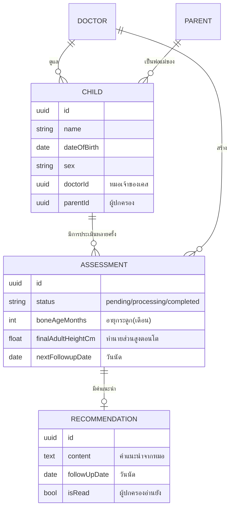

**อ่านง่าย ๆ:** หมอ 1 คนดูแลเด็กได้หลายคน → เด็ก 1 คนตรวจได้หลายครั้ง → การตรวจแต่ละครั้งมีคำแนะนำได้

---

## 🧠 9. AI ทำงานยังไง (5 ขั้นตอน)

ภาพ X-ray หนึ่งใบเดินทางผ่านโมเดล AI 5 ด่าน กว่าจะได้ผล:

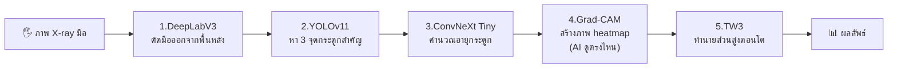

| ขั้น | โมเดล | ทำหน้าที่ (ภาษาคน) |
|------|-------|---------------------|
| 1 | **DeepLabV3** | ลบพื้นหลังให้เหลือแต่ "มือ" ลดสิ่งรบกวน |
| 2 | **YOLOv11** | วงกรอบ 3 บริเวณกระดูก (ข้อมือ, นิ้ว, ปลายแขน) |
| 3 | **ConvNeXt Tiny** | ดูกระดูกแล้วบอก "อายุกระดูกกี่เดือน" + ความมั่นใจ |
| 4 | **Grad-CAM** | ระบายสีจุดที่ AI ใช้ตัดสินใจ → โปร่งใส ตรวจสอบได้ |
| 5 | **TW3** | เอาอายุกระดูกไปทำนาย "ส่วนสูงตอนโตเต็มวัย" |

**ผลลัพธ์ที่ได้:** อายุกระดูก, ความมั่นใจ (%), ภาพ heatmap, ส่วนสูงที่คาดการณ์ (FAH), ส่วนสูงเป้าหมายตามพันธุกรรม (TH), เปอร์เซ็นไทล์ และธงเตือนความเสี่ยง (ปกติ/เตี้ย/สูง/กระดูกแก่/กระดูกอ่อน)

### 🧠 9.1 สถานะปัจจุบัน: โมเดลจริงบน HF Space

> **อัปเดต ก.ค. 2026:** AI ตอบผลจาก **โมเดลจริงของทีม** ที่โฮสต์บน HuggingFace Space (`FadyI22/BoneAssetmentV1`) แล้ว — **ระบบ mock ถูกถอดออกทั้งหมด** ถ้าโมเดลล่ม ระบบจะตอบสถานะ "ผิดพลาด" (FAILED) ให้หมอกด "วิเคราะห์ใหม่" แทนการปลอมผล (ในระบบการแพทย์ ผลปลอมอันตรายกว่าผลช้า)

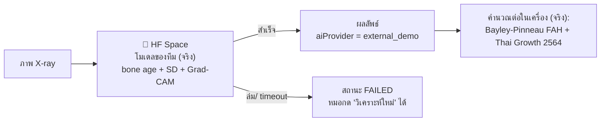

**สถานะแต่ละส่วน:**

| ส่วน | สถานะ |
|------|--------|
| อายุกระดูก + ค่าความไม่แน่นอน (SD) + ภาพ heatmap Grad-CAM | ✅ โมเดลจริงบน HF Space (เรียกด้วย `HF_TOKEN` เรียก 3 endpoint **เรียงลำดับ** — ยิงขนานทำ Space ล่ม) |
| สูตร Bayley-Pinneau ทำนายส่วนสูง + กราฟเกณฑ์ WHO/ไทย (`growth_standards.py`) | ✅ คำนวณจริงในเครื่อง |
| โครง API + รับ-ส่งภาพผ่าน signed URL + callback ไป Patient service | ✅ ของจริง ใช้งานได้ |
| In-house pipeline (DeepLabV3 → YOLOv11 → ConvNeXt รันในเครื่องเอง) | 🔜 ขั้นถัดไป — เอา weights จาก Colab มาวางใน `MODEL_DIR` + implement `load_models()` |

**ป้ายกำกับ:** ผลจากโมเดลนี้ติด `aiProvider="external_demo"` ไว้ในฐานข้อมูล (โมเดลทดลอง ยังไม่ผ่าน clinical validation) และทุกผลต้องผ่านการรีวิวของแพทย์ก่อนถึงผู้ปกครองเสมอ (ดู[หัวข้อ 5.2.5](#525-หมอรีวิวผลก่อนเสมอ--ผู้ปกครองยังไม่เห็น-)) ส่วนธง `isMock` ยังอยู่ในฐานข้อมูลเพื่อ backward-compat กับข้อมูลเก่าเท่านั้น — ผลใหม่ไม่มีทางเป็น mock

---

## 🧰 10. เทคโนโลยีที่ใช้ (สรุป)

| ส่วน | ใช้อะไร | คือ |
|------|---------|-----|
| หน้าเว็บ | **Next.js 14 + React + Tailwind** | สร้างหน้าจอสวย ๆ ตอบสนองเร็ว |
| Service หลังบ้าน | **NestJS (Node.js + TypeScript)** | เขียน API ฝั่งเซิร์ฟเวอร์ |
| AI | **Python + FastAPI + PyTorch** | รันโมเดล Deep Learning |
| ฐานข้อมูล | **PostgreSQL** | ตู้เก็บข้อมูลถาวร (แยก 2 ตู้: ผู้ใช้ / คนไข้) |
| เก็บไฟล์ภาพ | **Supabase Storage** | คลังเก็บภาพ X-ray / Heatmap / รูปโปรไฟล์ บนคลาวด์ |
| กระดานข่าว | **Redis** | ส่ง event ระหว่าง service |
| ส่งอีเมล | **SMTP (Gmail)** | ส่ง OTP + ผลตรวจ + เตือนนัด (production ควรเปลี่ยนเป็น Resend/Brevo) |
| รันสภาพแวดล้อม | **Docker** | จำลอง DB/Redis ด้วยคำสั่งเดียว (ตัว service ยังรันบนเครื่องตรง ๆ) |
| จัดการ packages | **pnpm (monorepo)** | ดูแลทุก service ในที่เดียว |

---

## 🔌 11. พอร์ตทั้งหมด + วิธีรัน

| Service | พอร์ต | เปิดให้ภายนอกไหม |
|---------|-------|------------------|
| 🖥️ Web | 3100 | ✅ ผู้ใช้เปิด |
| 🚪 Gateway | 3000 | ✅ ทางเข้า API เดียว |
| 🔐 Auth | 3001 | ❌ ภายในเท่านั้น |
| 👶 Patient | 3002 | ❌ ภายในเท่านั้น |
| 🧠 AI | 8000 | ❌ ภายในเท่านั้น |
| 🔔 Notify | 3004 | ❌ ภายในเท่านั้น |
| 🗄️ Postgres (auth) | 5432 | (ใน Docker) |
| 🗄️ Postgres (patient) | 5433 | (ใน Docker) |
| 📨 Redis | 6379 | (ใน Docker) |

**สั่งรัน (สรุปสั้น — รายละเอียดเต็มดู [README.md](./README.md)):**

```bash
pnpm docker:up    # 1) เปิด PostgreSQL + Redis
pnpm dev          # 2) เปิด service หลังบ้านทั้งหมด
pnpm dev:web      # 3) เปิดหน้าเว็บ (อีกหน้าต่าง terminal)
# เปิดเบราว์เซอร์ที่ http://localhost:3100
```

---

## 🗺️ 12. สรุปทั้งหมดในภาพเดียว

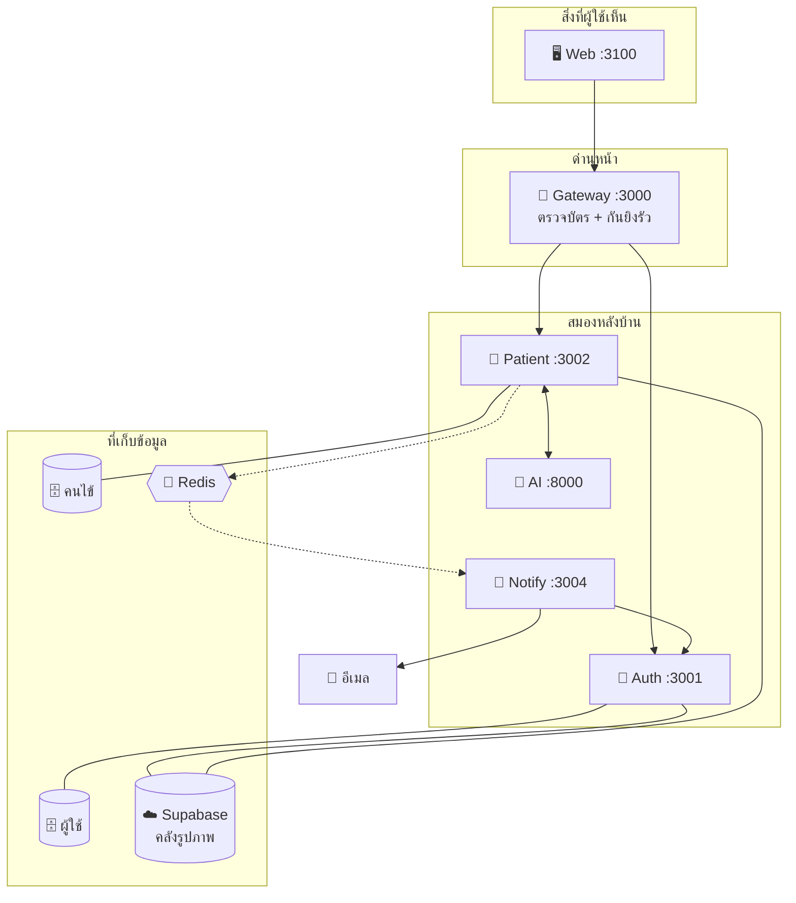

---

## 🚀 13. เส้นทางสู่ Production (จากเครื่องเรา → ให้โลกใช้)

> **Production คืออะไร?** = การเอาระบบขึ้น "เซิร์ฟเวอร์จริงบนอินเทอร์เน็ต" ให้หมอและผู้ปกครองใช้ได้จากที่ไหนก็ได้ ไม่ใช่แค่บนคอมเราเครื่องเดียว

### 13.1 ตอนนี้เราอยู่ตรงไหน — 🎉 ขึ้น Production แล้ว (ก.ค. 2026)

ระบบ**ออนไลน์จริงแล้ว**ตามผัง 13.2 ทุกประการ:

| ส่วน | ที่อยู่ | สถานะ |
|------|--------|--------|
| 🖥️ Web | **Vercel** — `totan-nsc2026-web.vercel.app` | ✅ ออนไลน์ |
| 🚪 Gateway | **Railway** — `gateway-production-9af4.up.railway.app` (URL สาธารณะเดียว) | ✅ ออนไลน์ |
| 🔐🧑‍⚕️🧠🔔 อีก 4 services + Postgres + Redis | **Railway** (เครือข่ายภายใน `*.railway.internal`) | ✅ ออนไลน์ |
| ☁️ ภาพ X-ray/Heatmap | **Supabase Storage** (bucket private + signed URL) | ✅ |
| 🚀 Auto-deploy | push ขึ้น GitHub `master` → Railway build เฉพาะ service ที่โค้ดเปลี่ยน | ✅ |

ส่วนบนเครื่องเรายังรันโหมด dev ได้เหมือนเดิม (Docker สำหรับ DB/Redis + `pnpm dev`) ไว้พัฒนาต่อก่อน push ขึ้นของจริง

### 13.2 เป้าหมาย (ตามที่เขียนไว้ใน Proposal ข้อ 7.1 และ 7.3)

Proposal ของเรากำหนดปลายทางไว้แล้ว: **Frontend ขึ้น Vercel / Backend + AI ขึ้น Railway / ไฟล์ภาพอยู่ Supabase**

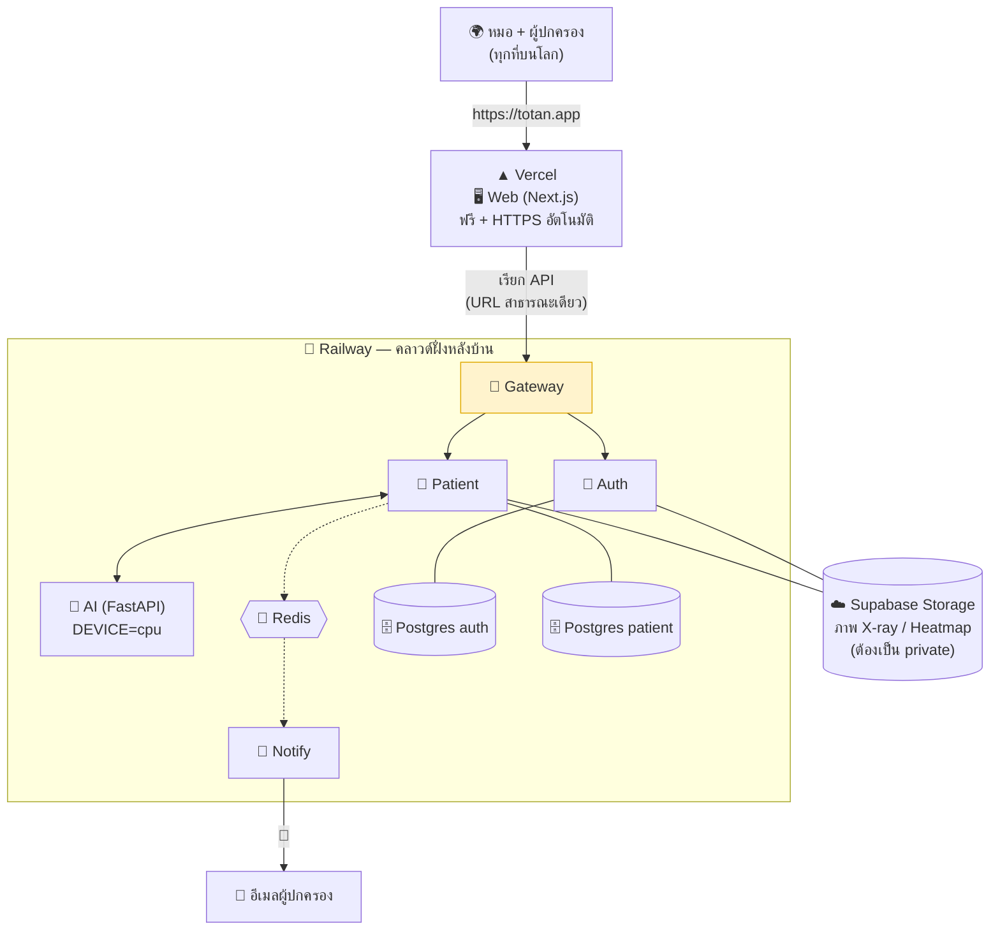

**หลักการสำคัญ 2 ข้อ (เหมือนตอน dev เป๊ะ แค่ย้ายบ้าน):**
1. **Gateway เป็นประตูเดียวที่มี URL สาธารณะ** — service อื่นคุยกันผ่าน "เครือข่ายภายใน" ของ Railway (`*.railway.internal`) โลกภายนอกแตะไม่ได้ → โมเดลความปลอดภัยเดิมของเรายังอยู่ครบ
2. **AI รันบน CPU ได้** — Railway ไม่มี GPU แต่ ConvNeXt Tiny + YOLOv11 ใช้ CPU อ่านภาพละไม่กี่วินาที และหน้าเว็บเราออกแบบเป็น polling (ถามเป็นระยะ) อยู่แล้ว รอได้สบาย

### 13.3 ด่าน Blockers เดิม — สถานะล่าสุด 🚧

| # | ด่าน | สถานะ (ก.ค. 2026) |
|---|------|--------------------|
| 1 | 🎭 **AI ยังเป็น Mock** | ✅ **แก้แล้ว** — ใช้โมเดลจริงของทีมบน HF Space + ถอด mock ทิ้งทั้งหมด (โมเดลล่ม = FAILED ไม่ใช่ผลปลอม ดู[หัวข้อ 9.1](#-91-สถานะปัจจุบัน-โมเดลจริงบน-hf-space)) — ขั้นถัดไปคือย้าย weights มารันในเครื่องเอง |
| 2 | 💣 **ฐานข้อมูลใช้โหมด auto-sync** | ⚠️ **ยังเปิดอยู่บน production** (ไม่ได้ตั้ง `DB_SYNC=false`) — สะดวกตอนโครงสร้างยังเปลี่ยนบ่อย แต่เสี่ยงข้อมูลจริงเสียหาย ควรปิด + ใช้ migration ก่อนมีผู้ใช้จริงจำนวนมาก |
| 3 | 🔓 **คลังรูปภาพเป็น public** | ✅ **แก้แล้ว** — bucket เป็น private, DB เก็บ key แล้วเซ็น **signed URL** ชั่วคราวก่อนส่งออกทุกครั้ง |

### 13.4 Checklist ความปลอดภัยก่อนปล่อยจริง 🔒

นอกจาก 3 ด่านใหญ่ ยังมีของเล็กที่ห้ามลืม:

- [ ] **เปลี่ยน secret ทุกตัว** — `JWT_SECRET` และ `INTERNAL_SECRET` ต้องสุ่มยาว ๆ ใหม่ (ห้ามใช้ค่าตอน dev เด็ดขาด และห้ามอยู่ใน git)
- [x] **CORS** — ✅ ตั้งแล้ว: `WEB_ORIGIN=https://totan-nsc2026-web.vercel.app` บน gateway
- [x] **อีเมล** — ✅ production ส่งผ่าน **Brevo HTTP API** แล้ว (`BREVO_API_KEY` — Railway บล็อก outbound SMTP จึงใช้ API ผ่าน 443) · ส่วน dev ในเครื่องยัง fallback เป็น Gmail SMTP ซึ่ง app password เดิมหมดอายุ — จะทดสอบเมลใน dev ให้เพิ่ม `BREVO_API_KEY` ใน `.env` ของ notify-service หรืออัปเดต app password ใหม่
- [ ] **Backup ฐานข้อมูล** — เปิด automated backup ของ Railway (ข้อมูลคนไข้หายคือหายจริง)
- [ ] **ระบบแจ้ง error** — ต่อ **Sentry** (ฟรี) จะได้รู้ทันทีเวลาระบบพังโดยไม่ต้องนั่งเฝ้า log
- [ ] **Patient service ห้ามหลับ** — ตัวเตือนวันนัด (scheduler ทุก 12 ชม.) อยู่ใน patient-service ถ้าใช้ plan ที่ service หลับได้ ตัวเตือนจะไม่ทำงาน

### 13.5 ลำดับงาน — ทำอะไรก่อนหลัง

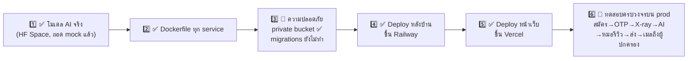

> 💡 **ทำไมข้อ 2 ต้องทดสอบใน Docker บนเครื่องก่อน?** เพราะถ้าทั้งระบบรันในกล่อง Docker บนเครื่องเราได้ = มันจะรันบนคลาวด์ได้เกือบแน่นอน แก้ปัญหาบนเครื่องเราง่ายกว่าแก้บนคลาวด์เยอะ

### 13.6 ค่าใช้จ่ายโดยประมาณ 💰

| บริการ | ใช้ทำอะไร | ราคา |
|--------|-----------|------|
| ▲ Vercel (Hobby) | หน้าเว็บ | **ฟรี** |
| ☁️ Supabase (Free tier) | คลังรูปภาพ | **ฟรี** (1 GB) |
| 🚂 Railway | 5 services + Postgres ×2 + Redis | **~$10–25/เดือน** (เครดิตฟรี $5 ไม่พอ) |
| 📧 Resend/Brevo | ส่งอีเมล | **ฟรี** (จำกัดจำนวน/วัน) |

> 💡 **เคล็ดลดค่าใช้จ่าย:** ใช้ Postgres **ตัวเดียว** บน Railway แล้วสร้าง 2 database ข้างใน (totan_auth / totan_patient) — แยกข้อมูลเหมือนเดิม แต่จ่ายค่าเครื่องเดียว

**ทางเลือก B (ถูกกว่าแต่เหนื่อยกว่า):** เช่า VPS เครื่องเดียว (~$6/เดือน เช่น Hetzner/DigitalOcean) แล้วรันทุกอย่างด้วย docker-compose + Caddy (ทำ HTTPS ให้อัตโนมัติ) — เหมาะถ้าอยากประหยัดและควบคุมเองทั้งหมด แต่ต้องดูแล backup/update/ความปลอดภัยเอง และ**ไม่ตรงกับที่เขียนไว้ใน proposal** → สำหรับ NSC แนะนำทาง Railway + Vercel ตาม proposal

---

> 📌 **ถ้ายังงงตรงไหน:** เริ่มจากหัวข้อ [5.2 (หมออัปโหลด X-ray)](#52-หมออัปโหลด-x-ray--ai-วิเคราะห์--ได้ผล--ขั้นตอนหัวใจ) — มันคือหัวใจของทั้งระบบ เข้าใจอันนี้แล้วที่เหลือจะต่อจิ๊กซอว์ได้เอง
>
> _เอกสารนี้อธิบายภาพรวมและ workflow — สำหรับวิธีติดตั้ง/รันแบบละเอียด ดู [README.md](./README.md)_
